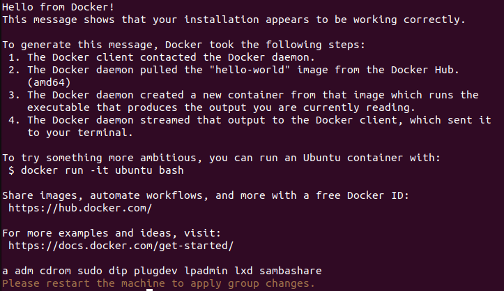
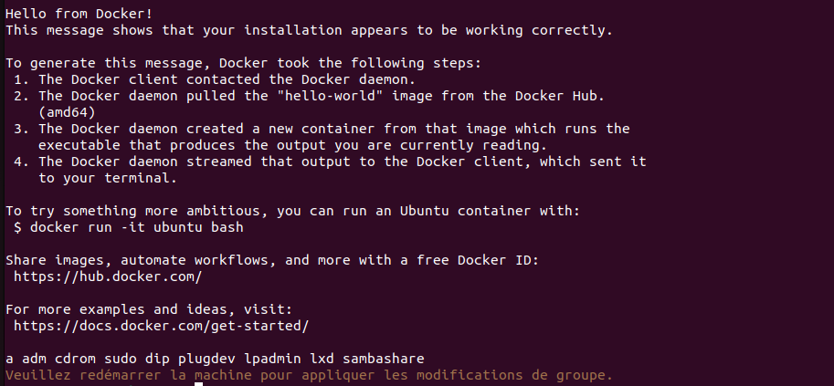

<h1 align="center">
<br>
<a href="https://github.com/StarKev"></a>
<br>
DockerEase
<br>
</h1>

[English](#english) | [Français](#français)

# English

## Script Description
The purpose of this script is to automatically and simply install and configure Docker with a single command. It allows the user running this script to no longer need to use `sudo` with Docker.

## Functions
- Install Docker and its dependencies.
- Add the user to the Docker group to avoid using `sudo` with Docker.
- Run a test container to verify the installation.
- Restart the Docker service to apply the changes.

## Script Execution
1. Download the script to your machine.
2. Open a terminal and navigate to the directory where the script is located.
3. Make the script executable with the command: `sudo chmod u+x DockerEase.sh`
4. Run the script with the command: `./DockerEase.sh`

## Example Script Output
When you run the script, you should see messages similar to the following:



## Important Notes
- After running the script, it is necessary to restart the machine for the group changes to take effect.
- Make sure you have sudo privileges to run this script.

## Uninstall Instructions

For uninstalling Docker and reverting changes made by this script, please refer to the [uninstall readme](./uninstall.md)

## Author

- [@StarKev](https://github.com/StarKev)

#

# Français

## Description du script
Le principe de ce script est d'installer et de configurer Docker de manière automatique et simplifiée grâce à une seule commande. Il permet à l'utilisateur qui exécute ce script de ne plus avoir besoin d'utiliser `sudo` avec Docker.

## Fonctions
- Installer Docker et ses dépendances.
- Ajouter l'utilisateur au groupe Docker pour éviter l'utilisation de `sudo` avec Docker.
- Exécuter un conteneur de test pour vérifier l'installation.
- Redémarrer le service Docker pour appliquer les modifications.

## Exécution du script
1. Téléchargez le script sur votre machine.
2. Ouvrez un terminal et accédez au répertoire où se trouve le script.
3. Rendez le script exécutable avec la commande : `sudo chmod u+x DockerEase.sh`
4. Exécutez le script avec la commande : `./DockerEase.sh`

## Exemple de sortie du script
Lorsque vous exécutez le script, vous devriez voir des messages similaires aux suivants :



## Notes importantes
- Après l'exécution du script, il est nécessaire de redémarrer la machine pour que les modifications de groupe prennent effet.
- Assurez-vous d'avoir les privilèges sudo pour exécuter ce script.

## Instructions de désinstallation

Pour désinstaller Docker et annuler les modifications apportées par ce script, veuillez vous référer au [readme de désinstallation](./uninstall.md)

## Auteur

- [@StarKev](https://github.com/StarKev)


## License


```text
Copyright (C) 2023-2024 StarKev

Licensed under the licenceCC BY-NC-SA 4.0 (the "License");
you may not use this file except in compliance with the License.
You may obtain a copy of the License at

    https://creativecommons.org/licenses/by-nc-sa/4.0/©

Unless required by applicable law or agreed to in writing, software
distributed under the License is distributed on an "AS IS" BASIS,
WITHOUT WARRANTIES OR CONDITIONS OF ANY KIND, either express or implied.
See the License for the specific language governing permissions and
limitations under the License.
```
